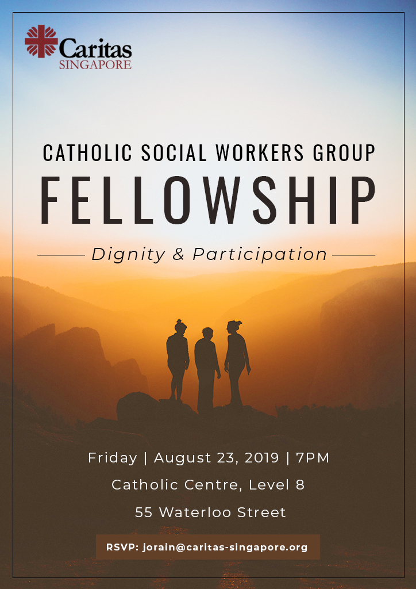
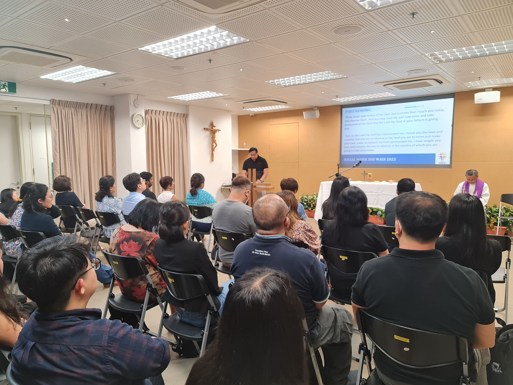
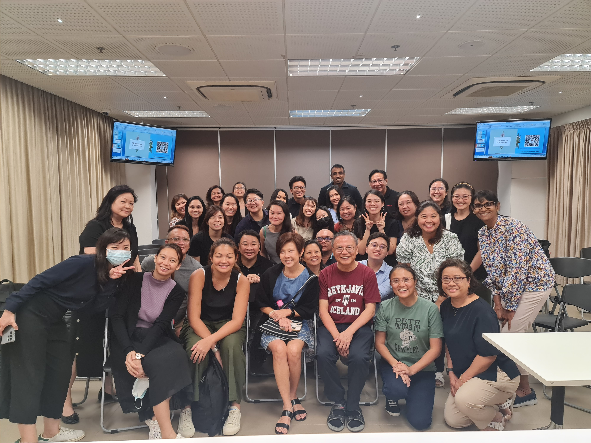

God himself is a community – Father, Son, and Holy Spirit. As His children, we too are created to be part of a community. To engage, to support, and to contribute so that we can grow together in faith and be stronger witnesses of Christ.

Recognising the importance of community, the Catholic Social Workers Group came together for a night of fellowship on 23 August 2019. Besides catching up and making new connections, attendees reflected on the application of two Catholic Social Teaching (CST) principles in their work – the Principle of the Dignity of the Human Person and the Principle of Participation.

One of the main takeaways by the group was to always strive to see Christ in the clients we serve, only then can a therapeutic relationship based on mutual trust, respect, and genuine care emerge.

