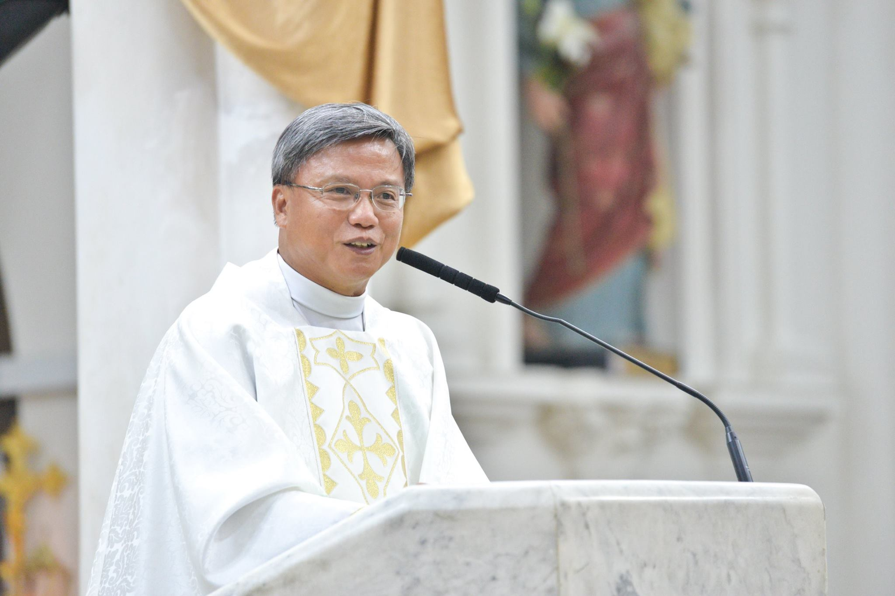
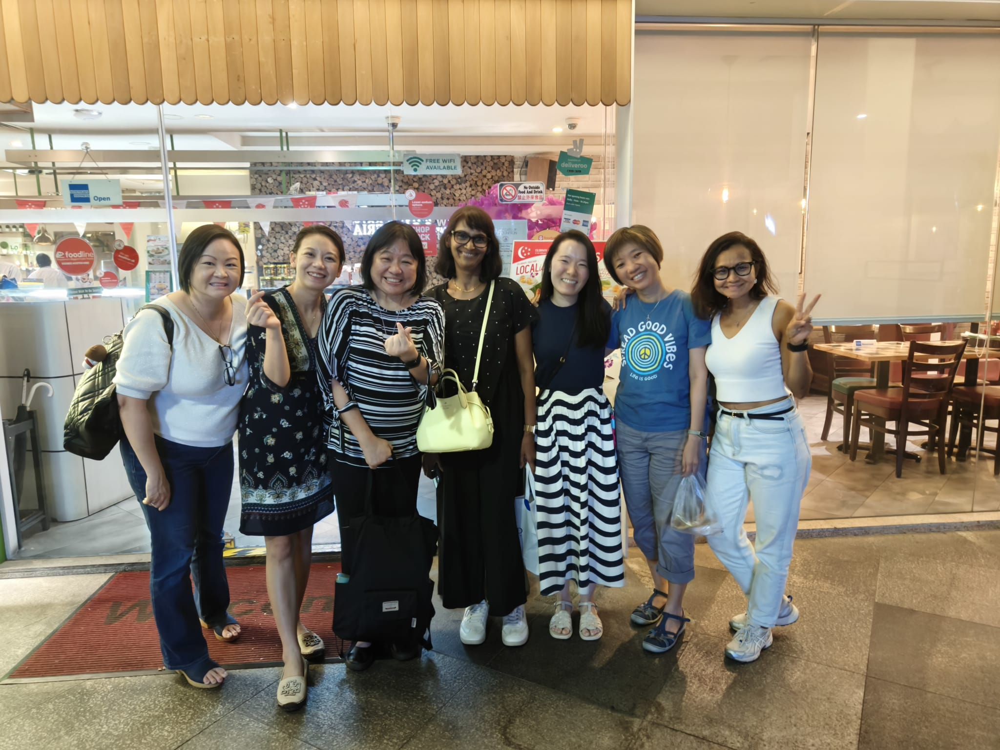

## Spiritual Director

Father Henry Siew, who generously provides guidance and spiritual direction for the Guild. With a background in social work, Father Siew has dedicated many years to leading faith formation groups and supporting their contributions to society.

## Executive Committee

The Executive Committee for 2024 consists of eleven committed members. They are trained social workers in diverse professional roles who volunteer their time and expertise to support the Guild's mission. They work collaboratively to foster a nurturing community for Catholic Social Workers.

### Office Bearers
- **President**: Mrs Grace Vaz
- **Vice-President**: Ms Janelle Janaki
- **Secretary**: Ms Heidi Ng
- **Treasurer**: Ms Melanie Goh-Joshua

### Committee Members
- Ms Geraldine Foo
- Ms Joycelyn Foo
- Ms Katherine Baptist
- Ms Sandra Loo
- Mr Robert Pollack
- Ms Jorain Ng
- Ms Eve Ong
